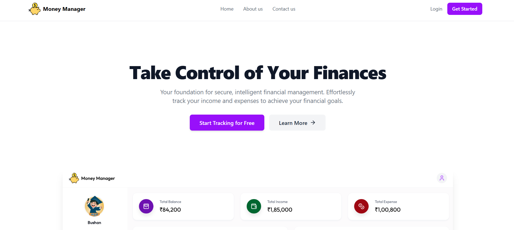
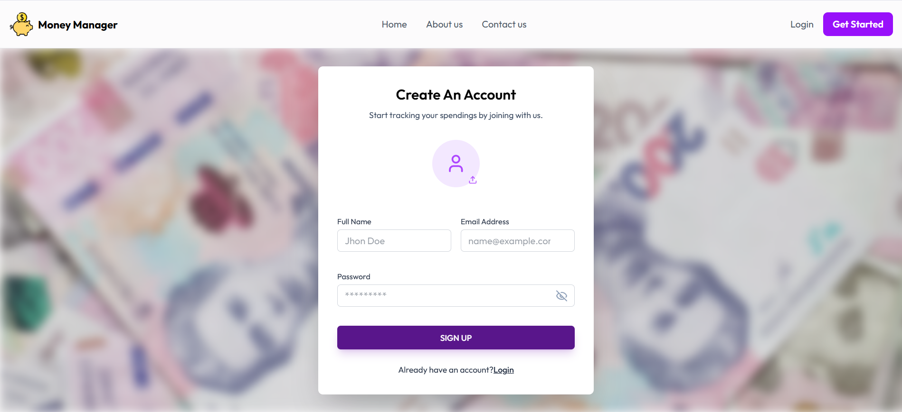
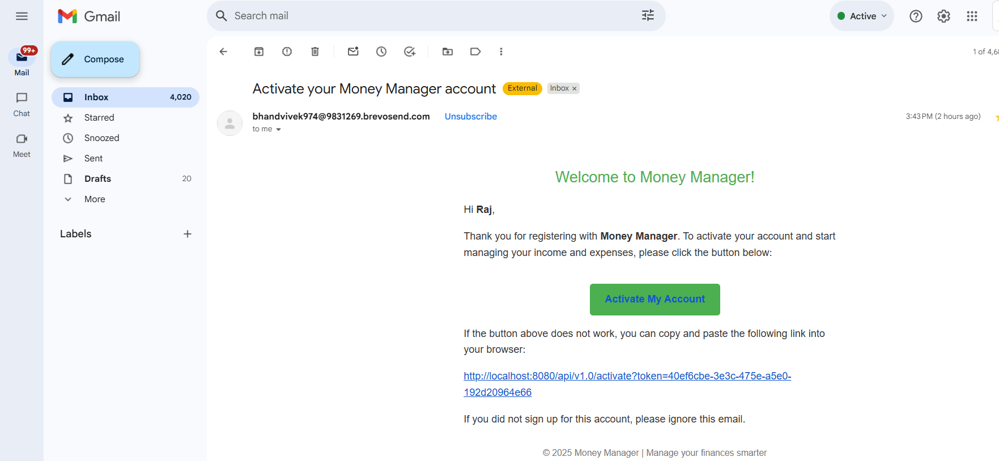
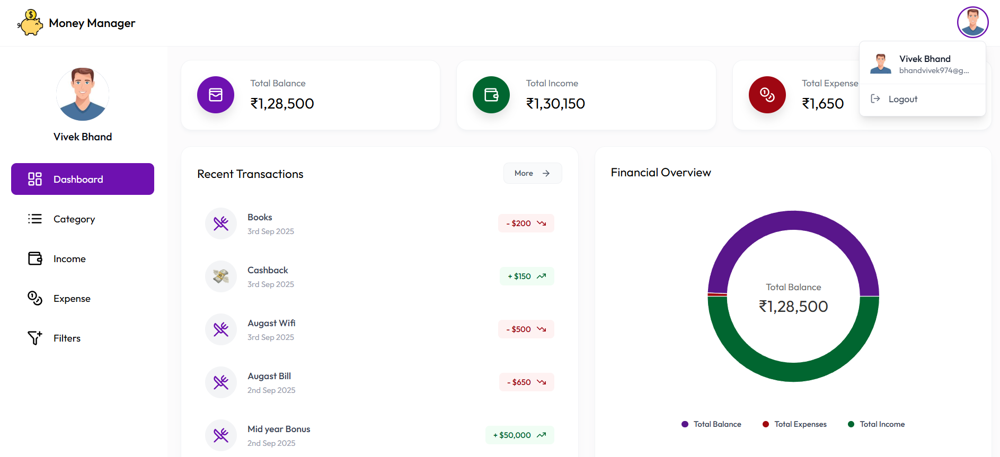
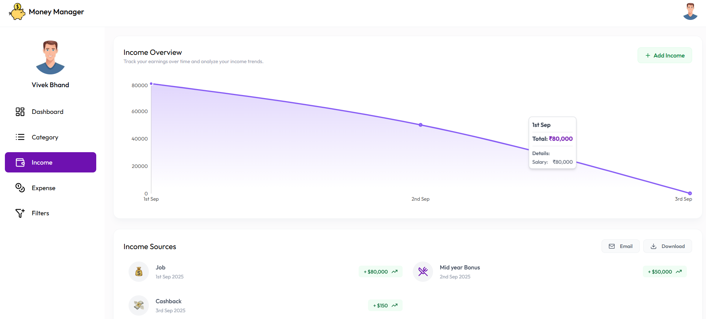
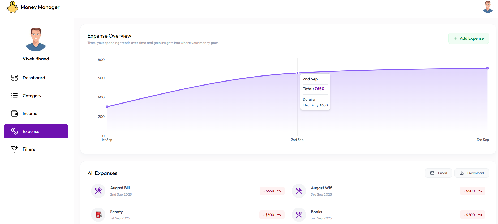
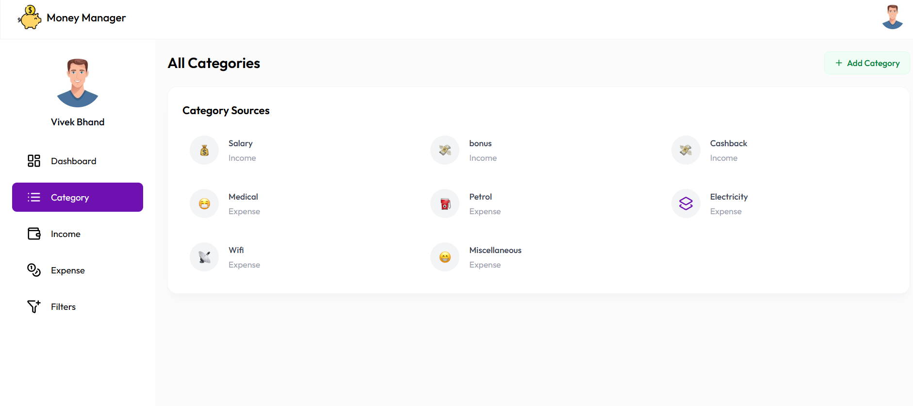
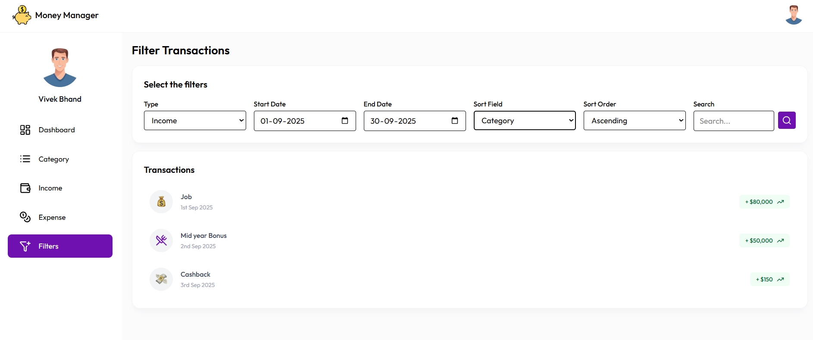
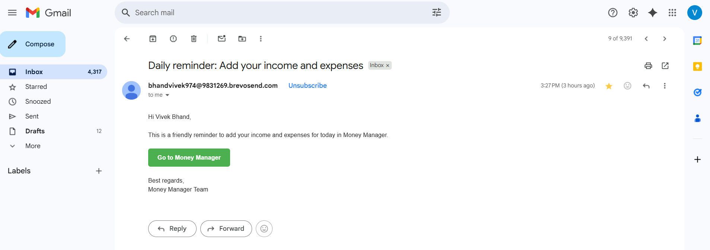
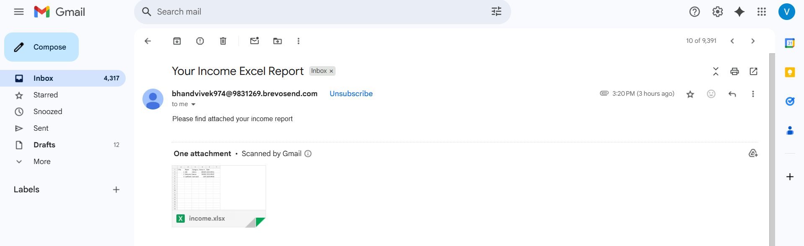

# 💸 **Intelligent-Finance-Orchestrator**  

💰 **Intelligent-Finance-Orchestrator** is a **Full-Stack Java Finance Management Application** designed to help users **track income, manage expenses, visualize spending patterns, and gain actionable financial insights with ease**.  
📊 It features a **secure authentication system, interactive dashboards with charts, detailed income & expense tracking, category management, and real-time financial summaries**. The application also provides **daily email notifications for reminders and expense summaries**, supports **Excel report generation**, and ensures a **responsive, modern UI for an enhanced user experience**.

---

## 🌟 **Features**
✔ **User Authentication & Email Verification** (with JWT & Brevo)  
✔ **Profile Photo Upload (Cloudinary)**  
✔ **Add Categories** (with icons & type: income or expense)  
✔ **User can Track, Add, Update & Delete Income and Expenses**  
✔ **Interactive Dashboard** with **charts & financial overview**  
✔ **Download Reports as Excel (Apache POI)** or **Send via Email**  
✔ **Filter Transactions** by multiple criteria  
✔ **Daily Email Notifications** (reminders & expense summary)  
✔ **Responsive & Beautiful UI with TailwindCSS**  

---

## 🛠 **Tech Stack**

### **Backend (Java + Spring Boot)**  
- ☑ **Spring Boot**  
- ☑ **Spring Data JPA**  
- ☑ **Spring Security with JWT Authentication**  
- ☑ **Spring Boot Starter Mail**  
- ☑ **MySQL Database**  
- ☑ **Lombok**  
- ☑ **Apache POI (Excel Export)**  
- ☑ **Brevo API (Email Service)**  
- ☑ **JJWT (Token Handling)**  

### **Frontend (React.js)**  
- ✅ **React.js**  
- ✅ **Axios**  
- ✅ **Lucide React**  
- ✅ **Tailwind CSS**  
- ✅ **React Hot Toast**  
- ✅ **Emoji Picker**  
- ✅ **React Charts**  
- ✅ **Cloudinary (Image Upload)**  

---

## ⚡ **Core Functionalities**
✅ **Secure Authentication & Email Verification**  
✅ **Add, Update & Delete Categories** (with icons & types)  
✅ **Add, Update & Delete Incomes & Expenses** (with filters & search)  
✅ **Interactive Charts & Dashboard** (Financial Overview)  
✅ **Export Reports to Excel & Send via Email**  
✅ **Daily Notifications via Email**  

---

## 📊 **Dashboard Features**
- **Total Balance**
- **Total Income**
- **Total Expense**
- **Top 5 Recent Transactions**
- **Pie Chart (Income vs Expense)**
- **Monthly Line Graph**

---

## 📧 **Email Features**
✔ **Account Activation**  
✔ **Daily Reminder**  
✔ **Daily Expense Summary**

---

## 📤 **Reports**
- **Download as Excel (Apache POI)**
- **Send via Email**

---

## 📸 **Screenshots**

### 🏠 **Hero Section**

---

### 🔐 **Authentication**
- **Login Page**

- **Register Page**

- **Email Activation**

---

### 📊 **Dashboard**

---

### 💰 **Income & Expenses**
- **Income Management**

- **Expense Management**

---

### 🗂 **Categories**

---

### 🔍 **Filters**

---

### 📅 **Daily Summary & Remainders**
- **Daily Summary**

- **Remainder**

---

### 📤 **Reports**

---

### 🖼 **Logo**

